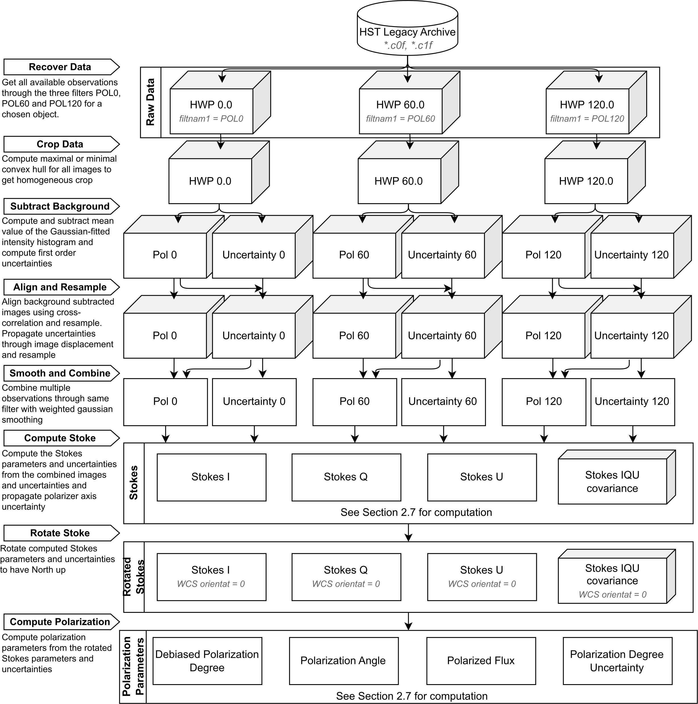

# (Legacy) HST Polarisation analysis
Reduction and analysis pipeline for the polarimetry capable (past) instruments onboard the Hubble Space Telescope.

**The general pipeline is still under development, only the FOC is fully implemented**

**General FOS pre-reduced polarimetry analysis has been added as user script**

This repository is mirrored from [this Codeberg repository](https://codeberg.org/Tibeuleu/FOC_Reduction). Issues, discussions and inquiries must be taken over there.

## TODO:
- Release as python package
- Build documentation
- Add all polarimetry capables instruments from HST (~FOC~, *FOS*, HSP, NICMOS, WF/PC, WFPC2, ACS)
- Build science case for future UV polarimeters (AGN outflow geometry, dust scattering, torus outline ?)

## Documentation


*Coming soon*

## Features
- Query and retrieved data from MastHST archives
- Multiple options for background estimation and subtraction
- Multiple deconvolution methods
- Cross-correlation image registration
- Multiple data combination methods
- Stokes cube generation with full uncertainty matrix propagation
- Interactive analysis tool with I and P cuts, slit and aperture integration

## Installation
The pipeline requires Python ≥ 3.11 with `numpy`, `scipy`, `astropy`, `astroquery` (for data retrieval), and `matplotlib` (for analysis tool and plot outputs).
*Python package coming soon*

---

## Associated paper and citation
If you use this pipeline in your work, please cite the following works:
Forgotten treasures in the HST/FOC UV imaging polarimetric archives of active galactic nuclei I. Pipeline and benchmarking [(Barnouin et al. 2023)](https://doi.org/10.1051/0004-6361/202347336)
```
@article{2023A&A...678A.143B,
       author = {{Barnouin}, T. and {Marin}, F. and {Lopez-Rodriguez}, E. and {Huber}, L. and {Kishimoto}, M.},
        title = "{Forgotten treasures in the HST/FOC UV imaging polarimetric archives of active galactic nuclei. I. Pipeline and benchmarking against NGC 1068 and exploring IC 5063}",
      journal = {\aap},
     keywords = {instrumentation: polarimeters, methods: observational, polarization, astronomical databases: miscellaneous, galaxies: active, galaxies: Seyfert, Astrophysics - Astrophysics of Galaxies, Astrophysics - High Energy Astrophysical Phenomena, Astrophysics - Instrumentation and Methods for Astrophysics, 85-04 (Primary), 85-08, 85A25 (Secondary), J.2, I.4.1, I.4.7, I.6.4},
         year = 2023,
        month = oct,
       volume = {678},
          eid = {A143},
        pages = {A143},
          doi = {10.1051/0004-6361/202347336},
archivePrefix = {arXiv},
       eprint = {2309.02167},
 primaryClass = {astro-ph.GA},
       adsurl = {https://ui.adsabs.harvard.edu/abs/2023A&A...678A.143B}
}
```

---

## License

This project is licensed under the MIT License. See the [LICENSE](./license.md) file for more details.

---

Contact: [T. Barnouin](https://orcid.org/0000-0003-1340-5675)
